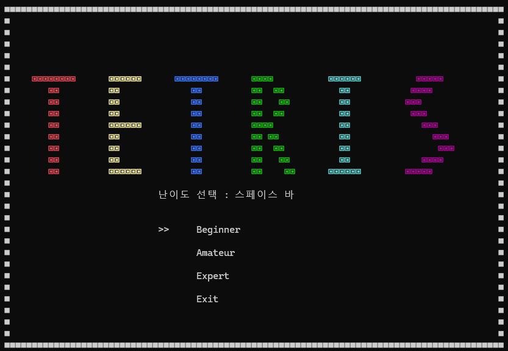
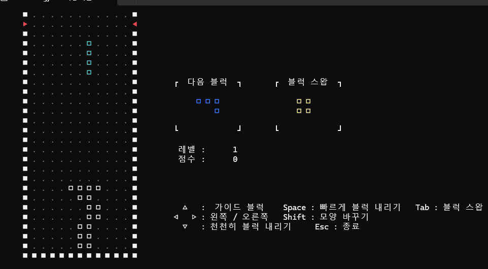
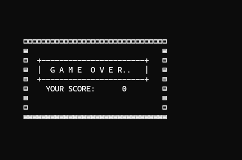

# 🎮 Console Tetris Game

C 언어와 Windows Console API를 사용하여 제작한 콘솔 기반 테트리스 게임입니다.

---

## 📌 Project Introduction

- 콘솔 환경에서 동작하는 테트리스 게임 구현
- 블록 회전 및 충돌 처리 구현
- 점수 및 레벨 시스템 구현
- 블록 스왑 및 가이드 기능 구현
- 난이도 선택 기능 구현

---

## ⚡ Main Features

### 🧩 Block System
- 다양한 테트리스 블록 구현
- 블록 회전 기능
- 블록 충돌 판정 처리

### 🎯 Game System
- 점수 시스템
- 레벨 증가 시스템
- 게임 오버 처리
- 난이도 선택 기능

### 🚀 Additional Features
- 하드 드롭 기능
- 블록 스왑 기능
- 가이드 블럭 표시
- 다음 블럭 미리보기

### 🔥 Difference From Other Projects
- 블록 데이터를 4차원 배열 구조로 구현하였습니다.

```c
block[블록종류][회전모양][세로][가로]
```
---

## 🛠 Tech Stack

<p align="center">


</p>

---

## ⌨ Controls

| Key | Function |
|---|---|
| ← → | Move Block |
| ↓ | Soft Drop |
| Space | Hard Drop |
| Shift | Rotate Block |
| Tab | Block Swap |
| ESC | Exit Game |

---

## 📂 Project Structure

```txt
Tetris/
├─ README.md
└─ main.c
```

---

## 📸 Preview

<p align="center">



<br>



<br>



</p>

---

## 📚 What I Learned

- 콘솔 좌표 제어 방식 이해
- 배열 기반 충돌 처리 구현
- 게임 루프 구조 학습
- Windows Console API 활용 경험
- 사용자 입력 처리 방식 학습

---

## 🚀 Development Environment

- Visual Studio 2022
- Windows Console
- C Language

---

## 👨‍💻 Developer

Yeongnam Kwon
